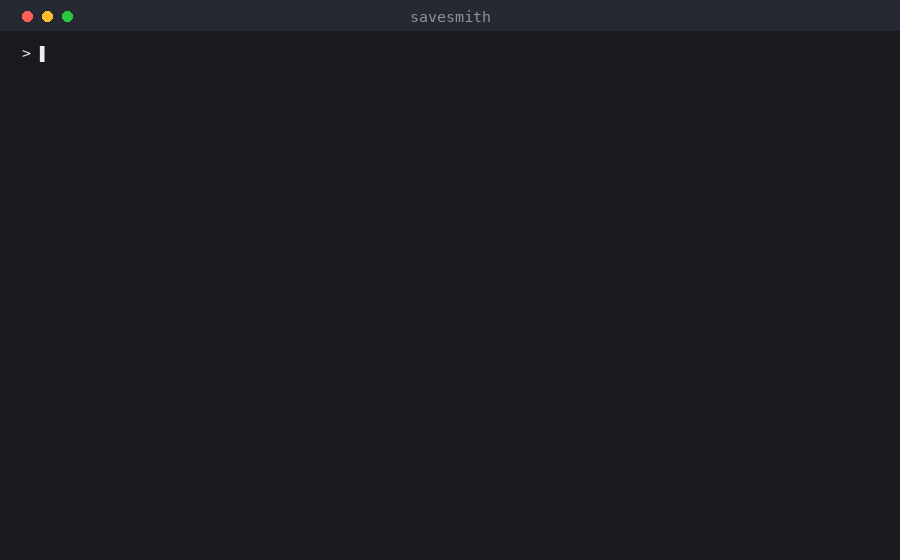

# SaveSmith

**Редактор сохранений для одиночных игр. Работает даже с играми, под которые редактора не существует.**

Ты указываешь папку, куда установлена игра. Программа сама находит сохранение, сама
понимает, в каком оно формате, и показывает, что в нём можно поменять. Перед любой
записью делает копию.



---

## Чтобы просто попробовать

**Ничего устанавливать не нужно.** Ни Python, ни чего-то ещё. Один файл.

### Windows

1. Скачай `savesmith.exe` (см. [Где взять файл](#где-взять-файл)).
2. Положи его куда угодно — хоть на рабочий стол.
3. Нажми `Win + R`, набери `cmd`, Enter. Откроется чёрное окно — это и есть
   командная строка, бояться там нечего.
4. Перетащи `savesmith.exe` мышкой прямо в это окно (путь подставится сам),
   допиши через пробел `doctor` и нажми Enter.

Программа расскажет, что она видит на твоём компьютере. Ничего не изменит — эта
команда только смотрит.

### macOS

То же самое, но окно называется «Терминал» (⌘+пробел → `Терминал`). Первый запуск
macOS заблокирует со словами «неизвестный разработчик»: **Системные настройки →
Конфиденциальность и безопасность → Подтвердить открытие**. Так будет, пока у
проекта нет платной подписи разработчика.

---

## Пять минут от начала до конца

Дальше везде вместо `savesmith` подставляй свой путь к файлу (или просто перетаскивай
его в окно мышкой). Путь к игре бери в кавычки, если в нём есть пробелы.

### 1. Что вообще установлено

```
savesmith scan
```

Покажет игры из Steam и рядом с каждой — насколько рискованно трогать её сохранения.

### 2. Найти сохранение

Игры почти никогда не держат сохранения рядом с собой — они прячут их где-нибудь в
`AppData`. Тебе знать этого не нужно:

```
savesmith find "C:\Games\Coin Quest"
```

Указываешь папку, куда игра **установлена**. Остальное — её работа.

### 3. Посмотреть, что можно поменять

```
savesmith show "C:\Games\Coin Quest"
```

Покажет поля с человеческими названиями: золото, здоровье, пройденные шаги. И
предупредит, если игра из тех, где за правку сейва бывают неприятности.

### 4. Поменять

```
savesmith set "C:\Games\Coin Quest" party._gold 99999
```

Перед записью автоматически делается копия. Путь к ней программа печатает.

### 5. Если что-то пошло не так

```
savesmith backups rpgmaker-mv
savesmith backups rpgmaker-mv --restore 0
```

Первая команда показывает список копий, вторая возвращает выбранную на место.
Копия того, что было до отката, тоже сохранится — откатить откат можно.

> **Главное правило: закрой игру перед правкой.** Многие игры держат сохранение в
> памяти и, выходя, перезаписывают файл своей версией. Правка просто исчезнет.

---

## А если моей игры нет в списке

Это нормально и это как раз то, ради чего всё затевалось. Плагинов под конкретные
игры пока три, а игр — миллион. Поэтому есть путь без плагина.

**Скажи программе число, которое видишь на экране игры**, и она найдёт, где оно
лежит в файле:

```
savesmith search "C:\Games\Моя Игра" 12400
```

Получишь список адресов. Дальше меняешь по адресу:

```
savesmith poke "C:\Games\Моя Игра" 0x1F4C:uint32-le 99999 --yes
```

Это работает даже с зашифрованными сохранениями: программа снимает все слои —
архив, шифрование, сжатие, — меняет число и собирает всё обратно, пересчитав
контрольные суммы. Проверено на настоящем сейве Elden Ring.

**Если мест нашлось много** — а так бывает, число вроде 100 встречается в файле
повсюду, — сделай два сохранения: одно до, другое после того как число изменилось.
Тогда:

```
savesmith diff сейв_до сейв_после --was 12400 --now 8000
```

Останется один-два адреса вместо сорока.

### Игры на Unity

Часть игр на Unity держит прогресс не в файле, а в настройках Windows. Их видно
той же командой `find`, а менять так:

```
savesmith prefs --game-folder "C:\Games\Моя Игра" --set coins 9999
```

---

## Что обязательно надо знать до того, как что-то менять

- SaveSmith — **для одиночных оффлайн-игр**. Не для онлайна.
- Правка сохранений часто нарушает пользовательское соглашение игры.
  Ответственность за последствия — на тебе.
- Встроенная оценка риска — **помощь, а не гарантия**. Разработчики меняют свои
  правила без предупреждения, а незнакомая игра по умолчанию считается требующей
  осторожности, а не безопасной.
- Достижения могут сброситься. Steam Cloud может перезаписать правленый сейв старой
  версией, если не выполнить шаги, о которых программа предупредит.
- **Антивирус и SmartScreen будут ругаться.** У файла нет цифровой подписи —
  сертификат стоит денег, которых у проекта пока нет. Это не значит, что файл
  безопасен потому, что так написано в README: исходники открыты, и собрать
  программу самому можно.

SaveSmith трогает **только файлы сохранений**. Он не читает и не пишет память чужих
процессов, не патчит `.exe` и `.dll`, ничего не внедряет в игру и не отключает
защиту. Это архитектурное решение: такого кода в проекте нет и не будет.

---

## Частые вопросы

**Нужен ли Python?** Нет. Один файл, внутри уже всё.

**Испортит ли это мой сейв?** Копия делается всегда, до записи, и вернуть её можно
одной командой. Кроме того, программа отказывается писать, если после сборки файла
не может прочитать своё же изменение обратно.

**Работает на пиратке?** Да, программа смотрит на файл сохранения, а не на то,
откуда взялась игра.

**Работает с играми под Windows, запущенными на маке?** Да — Whisky, CrossOver,
Wineskin. Бутылка определяется сама, отдельно ничего указывать не нужно.

**А виртуальная машина (Parallels, VMware)?** Нет. Файлы гостевой системы лежат
внутри образа диска, и прочитать их с хоста нельзя. Запусти SaveSmith внутри самой
виртуальной машины.

**Игра не видит мои изменения.** Она была запущена во время правки и перезаписала
файл. Закрой игру, откатись на копию, повтори.

---

## Где взять файл

Сборки под Windows и macOS собираются автоматически при каждом изменении кода и
лежат в артефактах [GitHub Actions](../../actions) — открой последний зелёный
прогон, внизу страницы будет раздел **Artifacts**.

Готовых релизов пока нет: проект ещё не выпущен.

---

## Что умеет

```
savesmith doctor                            что видно на этом компьютере
savesmith scan                              установленные игры и их тир риска
savesmith find "<папка игры>"               найти сейвы, зная только папку
savesmith show <сейв|папка>                 что в нём можно править
savesmith set <сейв|папка> <поле> <знач>    правка с бэкапом
savesmith search <сейв|папка> <число>       где лежит это число (без плагина)
savesmith poke <сейв|папка> <адрес> <знач>  правка по адресу (без плагина)
savesmith diff <до> <после> --was --now     найти поле, сравнив два сейва
savesmith prefs --game-folder <папка>       настройки Unity (PlayerPrefs)
savesmith backups <плагин>                  список копий и откат
savesmith identify <файл>                   определить формат сейва
savesmith discover <файл>                   разобрать незнакомый формат
```

Форматы, которые программа открывает сама, без плагина: gzip, zlib, base64,
JSON, MessagePack, LZString (RPG Maker MV и MZ), GVAS (Unreal Engine), BND4 и
зашифрованные слоты FromSoftware, Easy Save 3 (Unity), AES. Незнакомый файл
разбирается перебором — если он собран из знакомых слоёв, программа его вскроет.

Сохранения ищутся на Windows и macOS, включая Windows-игры, запущенные на маке
через Whisky, CrossOver или Wineskin: бутылка определяется сама.

## Поддерживаемые платформы

| Платформа | Статус |
|---|---|
| Windows 10/11 | полностью |
| macOS 13+ (Apple Silicon и Intel) | полностью |
| Windows-игры на маке (Whisky, CrossOver, Wine) | да, бутылка определяется сама |
| Linux | нет; программа честно скажет об этом, а не сломается молча |
| Виртуальные машины (Parallels, VMware) | нет — запускай SaveSmith внутри самой машины |

## Лицензия

Не выбрана. Проект ещё не выпущен.
